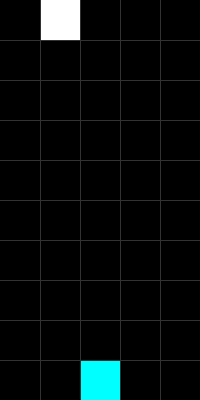
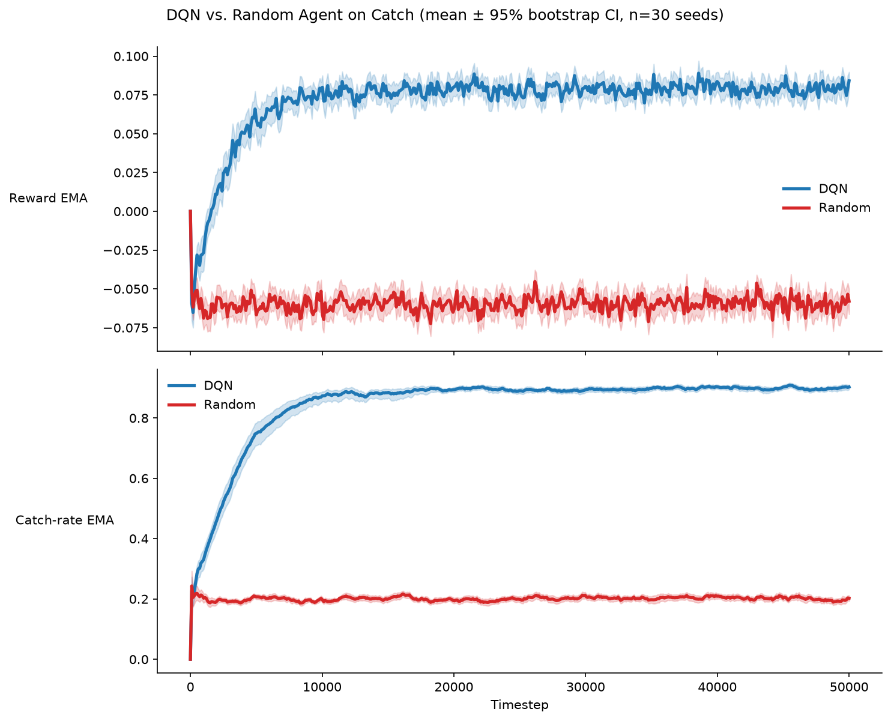
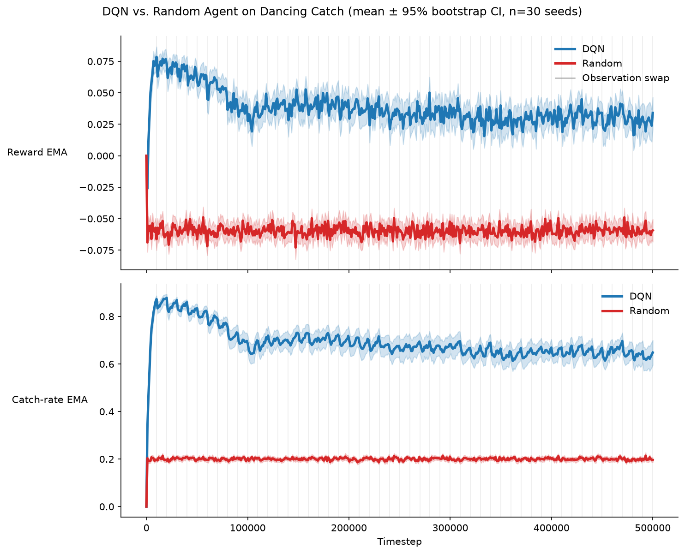

# catch-jax

A JAX implementation of the continuing Catch environment and its non-stationary
Dancing Catch variant, both from [google-deepmind/csuite](https://github.com/google-deepmind/csuite).
`reset` and `step` are pure functions and are fully JIT- and vmap-able, enabling
distributed training and large-scale experimentation.

## References

- **csuite repository:** google-deepmind/csuite. [https://github.com/google-deepmind/csuite](https://github.com/google-deepmind/csuite)

## Installation

Add it to your project with [uv](https://docs.astral.sh/uv/):

```sh
uv add git+https://github.com/panahiparham/catch-jax
```

## Usage

```python
import jax
import jax.numpy as jnp

from catch_jax import Catch, CatchParams

NUM_STEPS = 10

def main():
    # Create environment with default board size (10 rows x 5 columns)
    env = Catch()  # rows and columns are optional; defaults: 10, 5
    
    # Customize parameters as needed
    params = CatchParams(spawn_probability=0.1, max_steps_in_episode=1000)

    # Initialize random key
    key = jax.random.PRNGKey(42)
    reset_key, action_key, rollout_key = jax.random.split(key, 3)

    # Reset environment: returns (observation, state)
    obs, state = env.reset(reset_key)
    print(f"Initial board shape: {obs.shape}, dtype: {obs.dtype}")
    
    # Actions: 0 = LEFT, 1 = STAY, 2 = RIGHT
    actions = jax.random.randint(action_key, (NUM_STEPS,), 0, 3)

    @jax.jit
    def rollout(key, state, actions):
        def step(carry, action):
            key, state = carry
            key, subkey = jax.random.split(key)
            obs, state, reward, terminated, truncated, info = env.step(
                subkey, state, action, params
            )
            return (key, state), (obs, reward, state.timestep)

        (_, final_state), (obs_seq, rewards, timesteps) = jax.lax.scan(
            step, (key, state), actions
        )
        return final_state, obs_seq, rewards, timesteps

    final_state, obs_seq, rewards, timesteps = rollout(rollout_key, state, actions)

    # Print metrics for each step. The paddle row is never occupied by a ball
    # post-step (a landing ball is resolved and removed the same step), so
    # `obs_seq[t].sum() - 1` (minus the paddle's own cell) is the number of
    # balls currently falling.
    print(f"\nRollout over {NUM_STEPS} steps:")
    for t in range(NUM_STEPS):
        r = float(rewards[t])
        num_balls_falling = int(obs_seq[t].sum()) - 1
        print(f"  step {t:2d}  action={int(actions[t])}  "
              f"reward={r:+.0f}  "
              f"balls_falling={num_balls_falling}  "
              f"cumulative_reward={float(jnp.sum(rewards[:t+1])):+.0f}")

    # Render the final state as an RGB image
    rgb_image = env.render(final_state)
    print(f"\nRendered RGB image shape: {rgb_image.shape}, dtype: {rgb_image.dtype}")

if __name__ == "__main__":
    main()
```

`DancingCatch` and `DancingCatchParams` have the same interface, so the same code
works for the variant by swapping the class names.

## Variants

### Catch

**Observation:** A `float32` array of shape `(rows, columns)`, with 1.0 indicating
a ball or paddle and 0.0 indicating an empty cell.

**Actions:** 3 discrete actions: `0 = LEFT`, `1 = STAY`, `2 = RIGHT`. Actions are
applied as `dx = action - 1` with the paddle position clipped to `[0, columns - 1]`.

**Reward:** At each step:
- `+1.0` when a ball reaches the paddle row in the paddle's column
- `-1.0` when a ball reaches the paddle row in any other column
- `0.0` otherwise

**Termination:** The environment is continuing, so `terminated` is always `False`.
`truncated` fires when `timestep >= params.max_steps_in_episode`.

**Dynamics:** The paddle occupies the bottom row. Balls fall one row per step, staying
in the column they spawned in. Each step, with probability `spawn_probability` (default 0.1),
one ball appears at row 0 in a uniformly random column. A ball arriving at the paddle row
is scored and removed in the same step, so it is never drawn there. Within a step the
order is: move the paddle, descend the balls, resolve any ball on the paddle row, then spawn.

**Parameters:** `CatchParams(spawn_probability=0.1, max_steps_in_episode=10**9)`. Board
size is set on the constructor: `Catch(rows=10, columns=5)`.



The GIF shows a uniform-random policy over 120 steps, with the paddle and balls drawn
in different colours. Regenerate with:

```sh
uv run --group benchmark python make_gif.py
```

### Dancing Catch

Actions, reward, termination, and dynamics are identical to Catch. The observation differs.

**Observation:** A `float32` array of shape `(rows * columns,)`. The board is flattened
and read through a permutation held in `state.shuffle_idx`, so the observation is
`board.reshape(-1)[shuffle_idx]`.

**Non-stationarity:** `reset` starts the permutation at the identity. Every `swap_every`
steps the environment transposes two uniformly drawn entries of `shuffle_idx`, so the
mapping from observation index to board cell drifts over training.

**Parameters:** `DancingCatchParams(spawn_probability=0.1, swap_every=10_000, max_steps_in_episode=10**9)`.

**Rendering:** `render(state)` returns `uint8` of shape `(rows, columns, 3)` built from
the permuted observation, so the image shows the scrambled board.

## Benchmarks

Both benchmarks compare a small DQN agent against a uniform-random baseline across 30 seeds.
The agent implementation and hyperparameters are shared and defined in `benchmark_common.py`.

**Hyperparameters**

The hyperparameters are derived from the NeverEndingRL suite (`position_catch/Catch50k/DQN.json`):

| Hyperparameter | Value |
| --- | --- |
| Total timesteps | Differs per benchmark, given below |
| Seeds | 30 |
| Replay buffer size | 100,000 (uniform, iid sampling) |
| Batch size | 32 |
| Update frequency | Every 4 environment steps |
| Target network refresh | Hard copy every 128 steps |
| Warm-up | Updates begin once buffer >= batch size (32 transitions) |
| Epsilon | 0.01 (constant epsilon-greedy) |
| Optimizer | Adam: learning rate 0.01, beta1=0.9, beta2=0.999, eps=1e-8 |
| Network | 2 hidden layers x 32 units, ReLU activation |
| Discount (gamma) | 0.9 |

**Metrics**

Two exponential moving averages (EMA) are tracked with beta=0.99:

1. **Reward EMA:** Updated every step with the raw reward (-1, 0, or +1). Since Catch is
   continuing (no episode termination), we track the moving average of step rewards to
   assess convergence of the agent's behavior.

2. **Catch-rate EMA:** Event-gated, updated only on steps where a ball is resolved
   (reward != 0). The value is 1.0 for a catch and 0.0 for a miss. On steps where no
   ball resolves (reward = 0), this EMA is unchanged. This metric isolates the agent's
   accuracy when catching is possible.

Both EMAs are bias-corrected at each step using the standard correction:
`ema_corrected = ema / (1 - beta^n)`, where n is the count of updates (different for each EMA).

### Catch

50,000 timesteps, 30 seeds.



Run with:

```sh
uv run --group benchmark python benchmark_dqn.py
```

### Dancing Catch

500,000 timesteps, 30 seeds, `swap_every=10_000` giving 50 observation swaps, which the
plot marks with vertical guidelines.



Run with:

```sh
uv run --group benchmark python benchmark_dancing_catch.py
```

## Throughput

These measure environment steps per second on CPU. Compilation time is excluded.
The numbers below were measured on an Apple M1 CPU with 8 cores.

Run with:

```sh
uv run --group benchmark python benchmark_throughput.py
```

**Environment throughput, random policy**

The vmapped rows count total steps across all environments.

| Implementation | Environments | Steps/sec | Speedup vs. numpy |
| --- | --- | --- | --- |
| csuite (numpy) | 1 | 73,100 | 1x |
| catch-jax | 1 | 159,000 | 2.2x |
| catch-jax | 8 | 733,000 | 10x |
| catch-jax | 64 | 2,782,000 | 38x |
| catch-jax | 512 | 5,201,000 | 71x |
| catch-jax | 4096 | 3,679,000 | 50x |

**Agent throughput on catch-jax**

Measured at one seed, so each row is a single agent stepping its own environment
with its own replay buffer. Multi-seed runs scale by vmapping over independent
streams like these rather than by batching environments under one agent.

| Agent | Steps/sec |
| --- | --- |
| Random | 135,000 |
| DQN | 55,000 |
